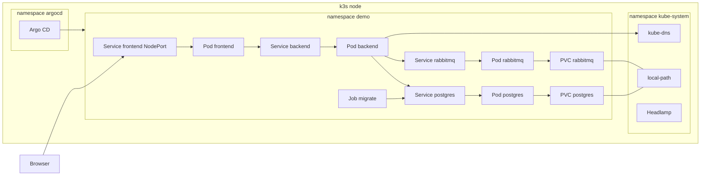
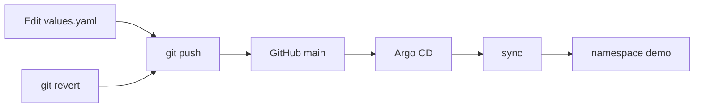
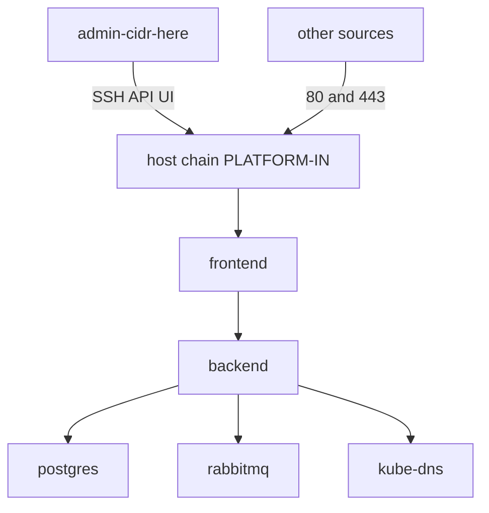

# k3s GitOps platform

Одноузловой шаблон: k3s, Helm, Argo CD и изоляция сети. Свой backend и frontend подставляются сменой образа и нескольких полей в `charts/app-stack/values.yaml`.

[](https://github.com/Thepowerfulmark/k3s-gitops-platform/actions/workflows/images.yml)
[](https://github.com/Thepowerfulmark/k3s-gitops-platform/actions/workflows/ci.yml)

Разработка и тестирование проводились на k3s `v1.36.4+k3s1`, Helm `v3.22.0`, Argo CD `v2.13.3`.

Секретов в репозитории нет. Полная установка — в [docs/runbook.md](docs/runbook.md). Схемы ниже повторены в [docs/architecture.md](docs/architecture.md).

## Быстрый старт

На новом узле, от `root`:

```bash
git clone https://github.com/Thepowerfulmark/k3s-gitops-platform.git
cd k3s-gitops-platform
bash bootstrap/install-k3s.sh
bash bootstrap/install-helm.sh && bash bootstrap/install-argocd.sh && bash bootstrap/install-headlamp.sh
k3s kubectl create namespace demo
k3s kubectl -n demo create secret generic app-credentials --from-literal=postgres-user=app --from-literal=postgres-password=replace-from-vault --from-literal=postgres-database=app --from-literal=rabbitmq-user=app --from-literal=rabbitmq-password=replace-from-vault --from-literal=rabbitmq-vhost=app
k3s kubectl apply -f argocd/project.yaml -f argocd/application.yaml
```

Откройте `http://node-ip-here:30080`. Если у узла есть имя, подойдёт и `http://example.com:30080`. Argo CD — порт `30081`, Headlamp — `30082`. В UI Argo CD Application `demo` должно быть Synced и Healthy.

Если k3s, Argo CD или Headlamp уже стоят, соответствующий скрипт печатает версию и не перезапускает службу.

## Схемы

Диапазоны `10.42.0.0/16` и `10.43.0.0/16` на схемах — значения по умолчанию k3s (адреса подов и Service), не адрес стенда.

### Кластер



### GitOps



### Сеть



NetworkPolicy в чарте запрещает трафик подов и затем разрешает обмен внутри namespace, DNS и вход на порт frontend. Скрипт файрвола ограничивает SSH, API и NodePort UI сетью `admin-cidr-here`. Порты 80 и 443 на хосте остаются открытыми. Чарт файрвол не включает.

## Как подставить своё приложение

Замените каталоги `apps/backend` и `apps/frontend` или укажите свои образы. Меняются поля в `charts/app-stack/values.yaml`:

| Поле | Зачем |
|---|---|
| `backend.image.repository`, `backend.image.tag` | образ API |
| `backend.service.port` | порт контейнера и Service |
| `backend.healthPath` | проверка готовности, по умолчанию `/health` |
| `backend.secretEnv` | какие ключи Secret попадают в переменные окружения |
| `frontend.image.repository`, `frontend.image.tag` | образ UI |
| `frontend.service.nodePort` | порт на узле, по умолчанию `30080` |
| `existingSecret` | имя уже созданного Secret |
| `networkPolicy.frontendIngressCIDR` | кто может открыть UI; пусто — любой источник |

Пароли в values не пишутся. Secret создаётся отдельно, ключи: `postgres-user`, `postgres-password`, `postgres-database`, `rabbitmq-user`, `rabbitmq-password`, `rabbitmq-vhost`. Хосты Postgres и брокера чарт подставляет сам.

Демо-API пишет строку в Postgres и публикует тот же JSON в очередь `items` через HTTP API брокера на порту `15672`. Если очередь не приняла сообщение, ответ `502`, строка в базе уже есть.

Образы демо собирает GitHub Actions и кладёт в GHCR:

- `ghcr.io/thepowerfulmark/k3s-gitops-platform-backend`
- `ghcr.io/thepowerfulmark/k3s-gitops-platform-frontend`

Push в `main` даёт тег `sha-<commit>`. Git-тег `vX.Y.Z` даёт тег образа `X.Y.Z`. В values для `v0.1.0` записан тег `0.1.0`.

## Глоссарий

| Термин | Как это используется здесь |
|---|---|
| Kubernetes | Оркестратор. Чарт описывает желаемое состояние, кластер его поддерживает. |
| k3s | Дистрибутив Kubernetes. `bootstrap/install-k3s.sh` ставит его на один узел и выключает Traefik и ServiceLB, потому что UI публикуется через NodePort. |
| Namespace | Отдельная область имён. Приложение живёт в `demo`, Argo CD — в `argocd`, DNS и Headlamp — в `kube-system`. |
| Pod | Один или несколько контейнеров с общей сетью. Frontend, backend, Postgres и RabbitMQ — отдельные поды. |
| Deployment | Контроллер подов без своего диска. Так запущены backend и frontend: при смене образа поднимается новый под. |
| StatefulSet | Контроллер с устойчивым именем и своим томом. Postgres и RabbitMQ — StatefulSet, данные лежат на PVC. |
| Service | Стабильное DNS-имя. Frontend смотрит на Service backend, backend — на Service postgres и rabbitmq. |
| Ingress | Правило HTTP-маршрута внутрь кластера. В чарте его нет: снаружи UI открывается NodePort Service, Traefik выключен. |
| PersistentVolume и PVC | Том и заявка на него. Чарт создаёт PVC для Postgres и RabbitMQ через `volumeClaimTemplates`. |
| StorageClass local-path | Класс по умолчанию в k3s. Он создаёт каталог на диске узла. Другой класс задаётся полем `storageClass`. |
| Secret | Пароли. Их кладут в Secret `app-credentials` командой `kubectl create secret`. В git их нет. |
| ConfigMap | Несекретный текст. Nginx frontend рендерится в ConfigMap из чарта. |
| Helm | Установщик пакетов для Kubernetes. Локально чарт проверяют `helm lint` и `helm template`. |
| Chart, values, release | Chart — каталог `charts/app-stack`. Values — `values.yaml`. Release — установленный экземпляр, в примере имя `demo`. |
| Argo CD | Контроллер, который читает git и применяет чарт. Ставится скриптом `bootstrap/install-argocd.sh`, UI на NodePort `30081`. |
| Application, sync, selfHeal, prune | `argocd/application.yaml` следит за git. Sync приводит кластер к git, selfHeal возвращает ручные правки, prune удаляет объекты, которых в git уже нет. |
| GitOps | Кластер меняется коммитом. Новый тег образа и откат делаются через git. |
| NetworkPolicy и default-deny | Объекты чарта запрещают трафик подов, кроме явных правил: внутри namespace, DNS и вход на порт frontend. |
| Job | Разовая задача. Job миграции создаёт таблицу `items` и завершается. |
| Readiness и liveness probe | Readiness бьёт в `/health` и не пускает трафик, пока Postgres или брокер недоступны. Liveness бьёт в `/healthz` и проверяет только процесс. |
| Requests и limits | Сколько CPU и памяти под просит и сколько памяти ему можно занять. Числа лежат в `values.yaml` и рассчитаны на один небольшой узел. |
| CNI и flannel | Сеть подов. k3s по умолчанию выдаёт подам адреса из `10.42.0.0/16` через flannel. |
| kube-router | В k3s встроен его контроллер NetworkPolicy. Адресацию подов при этом делает flannel. |
| NodePort | Service открывает порт на узле. Frontend слушает `frontend.service.nodePort` (`30080`). Argo CD и Headlamp в bootstrap публикуются так же. |

## Как это устроено

- `bootstrap/install-k3s.sh` — k3s без Traefik и ServiceLB. Повторный запуск не перезапускает уже стоящий k3s.
- `bootstrap/install-helm.sh` — Helm `v3.22.0`.
- `bootstrap/install-argocd.sh` — Argo CD `v2.13.3`, UI на порту `30081`.
- `bootstrap/install-headlamp.sh` и `bootstrap/headlamp.yaml` — панель, UI на порту `30082`.
- `charts/app-stack` — backend, frontend, Postgres, RabbitMQ, Job миграции, NetworkPolicy. Secret чарт не создаёт: ждёт `existingSecret`.
- `argocd/project.yaml` и `argocd/application.yaml` — проект и Application с automated sync, selfHeal и prune.
- `apps/backend`, `apps/frontend` — демо, которое заменяют своим кодом.
- `security/host-firewall.sh` — цепочка `PLATFORM-IN` и таймер отката. `security/default-deny.yaml` — тот же смысл политик без Helm.
- `.github/workflows/images.yml` — сборка и публикация образов в GHCR.
- `.github/workflows/ci.yml` — shellcheck, `helm lint`, kubeconform, gitleaks и тесты API.

## Безопасность

Пароли не коммитятся. Чарт читает их из Secret, который создаётся в кластере.

NetworkPolicy начинает с запрета. Снаружи в поды пускается только порт frontend, и это поле можно сузить CIDR.

Файрвол хоста — отдельный шаг. `apply` сохраняет текущие правила и ставит таймер. `commit` оставляет цепочку и включает её при загрузке. `rollback` возвращает сохранённые правила. Пока таймер не снят, держите исходную SSH-сессию открытой.

У подов приложения нет токена ServiceAccount. У контейнеров backend и frontend сняты лишние capabilities, корневая файловая система только для чтения.

## Ограничения

Один узел. Отказ машины останавливает и приложение, и Argo CD. Это не HA.

Тома `local-path` лежат на диске этого узла. Перенос пода на другой узел их не подхватит.

selfHeal затирает правки, сделанные вручную в кластере. Откат — `git revert`.

Скрипт файрвола меняет только IPv4 и не запускается чартом. Его включают на узле, который готовы закрыть.

## CI

Push и pull request в `main` гоняют проверки. Push в `main` и git-тег `vX.Y.Z` публикуют образы. Описание шагов установки, обновления и отката — в [docs/runbook.md](docs/runbook.md).
