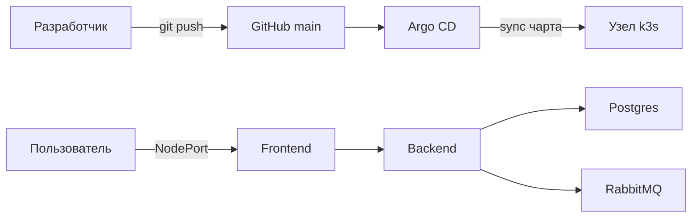
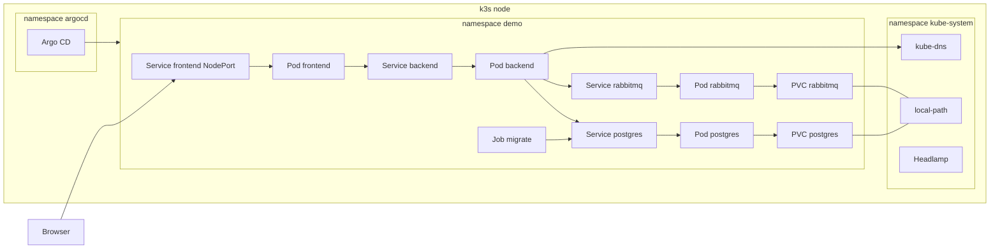
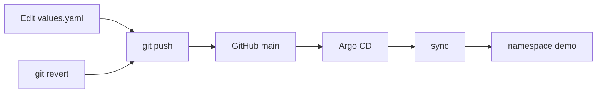
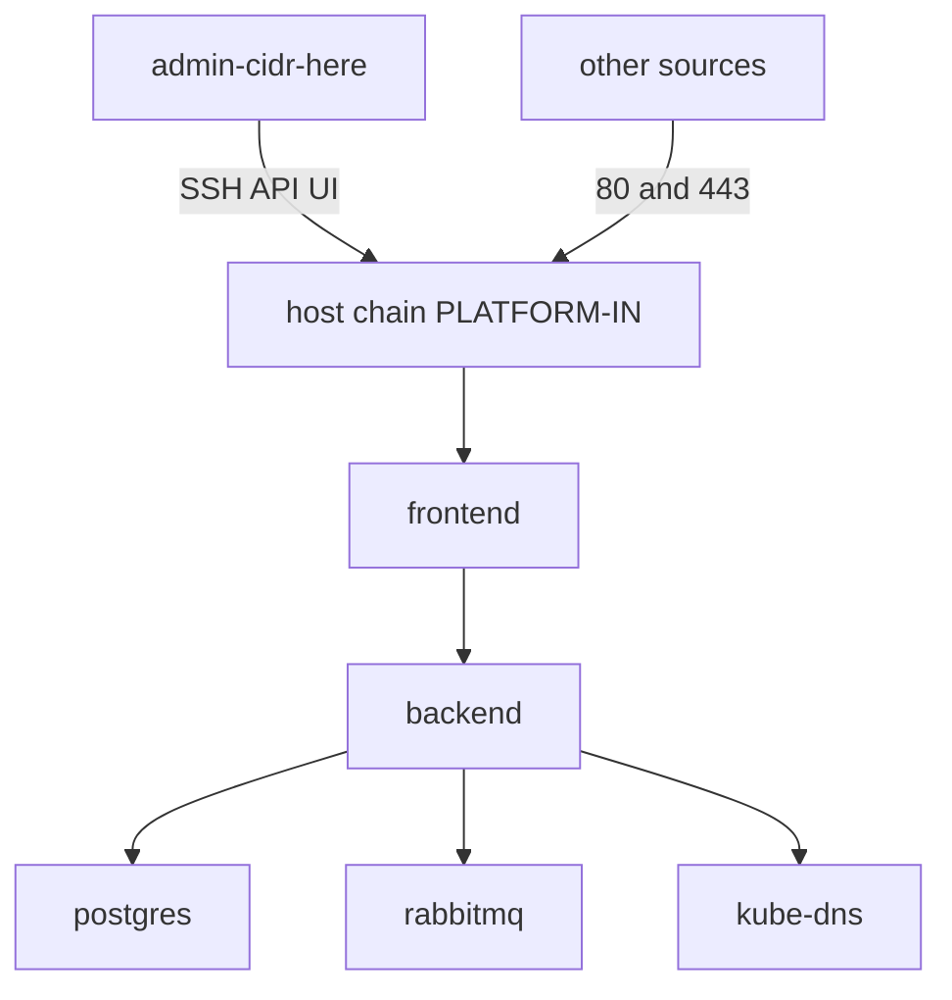

# k3s GitOps platform

Одноузловой кластер, в котором свой backend и frontend выкатываются коммитом в git, а сеть закрыта, пока вы сами не откроете путь.

[](https://github.com/Thepowerfulmark/k3s-gitops-platform/actions/workflows/ci.yml)
[](https://github.com/Thepowerfulmark/k3s-gitops-platform/actions/workflows/images.yml)


## О проекте

Этот репозиторий решает конкретную задачу: на одной виртуальной машине быстро поднять изолированный GitOps-кластер и выкатить в него свой backend вместе с frontend. Рядом уже стоят Postgres и RabbitMQ, у обоих есть постоянный том, а перед стартом API отрабатывает разовая миграция. Сеть подов по умолчанию ничего лишнего не пропускает. Вам не нужно собирать Deployment, Service, том, Job и NetworkPolicy из разрозненных примеров. Клонируете репозиторий, ставите k3s и Argo CD, кладёте пароли в Secret и открываете интерфейс по порту узла. Дальше любое изменение приложения идёт через git.

Шаблон рассчитан на небольшую команду, которой нужен стенд, короткая проверка идеи или учебный кластер. Он подходит и одному инженеру, который хочет показать, как связаны Helm, GitOps и сетевая изоляция, не заказывая для этого три машины и балансировщик. Это честный одноузловой контур с закреплёнными версиями. Высокой доступности здесь нет: отказ машины останавливает и приложение, и Argo CD. Для первой выкладки, демонстрации работодателю и спокойной учёбы этого достаточно.

На выходе вы получаете namespace, в котором работают поды интерфейса и API, StatefulSet базы и очереди, Job миграции и Application в Argo CD. Контроллер сам подтягивает ветку `main` и приводит кластер к чарту. Интерфейс открывается через NodePort. Панель Argo CD и Headlamp тоже доступны с узла, каждая на своём порту. Демо-образы публикует GitHub Actions в GHCR. Свои образы подставляются несколькими полями в `charts/app-stack/values.yaml`. Пароли в репозиторий не попадают: чарт только читает уже созданный Secret.

От разового `kubectl apply` этот шаблон отличается тремя свойствами, которые видны в файлах, а не в обещаниях. Желаемое состояние живёт в git. Argo CD сравнивает кластер с репозиторием, синхронизирует чарт, возвращает ручные правки через selfHeal и удаляет объекты, которых в git больше нет, через prune. Откат — это `git revert`: следующий sync возвращает предыдущий коммит, включая тег образа. Изоляция сети включена сразу: NetworkPolicy начинает с запрета, а файрвол хоста умеет сам откатиться, если новая цепочка отрежет SSH. Секреты создаются в кластере отдельно от чарта, поэтому репозиторий можно держать публичным и не вычищать пароли из истории.

## Возможности

- Helm-чарт `charts/app-stack` описывает backend, frontend, Postgres, RabbitMQ, миграцию и политики сети одним release. Пароли он не генерирует и не хранит: поле `existingSecret` называет Secret, который вы создали в кластере заранее, и чарт только подставляет его ключи в окружение подов.
- Argo CD Application в `argocd/application.yaml` следит за веткой `main` с automated sync, selfHeal и prune. Коммит сам доезжает до кластера, правка через `kubectl` не остаётся, а объект, удалённый из чарта, удаляется и в кластере.
- NetworkPolicy в чарте начинается с default-deny. Дальше явно разрешены обмен внутри одного namespace, запросы к DNS и вход на порт frontend. Остальной трафик к подам закрыт, пока вы не измените правила.
- Скрипт `security/host-firewall.sh` заводит собственную цепочку `PLATFORM-IN` и не подменяет чужие правила целиком. Режим применения ставит таймер автоотката: если после включения вы потеряете SSH, сохранённые правила вернутся сами. Постоянное включение — отдельный шаг, когда вы убедились, что вход ещё есть.
- Job миграции создаёт таблицу `items` и завершается. Имя Job зависит от тега образа, поэтому новый тег даёт новую задачу, а повторный прогон не ломает уже созданную таблицу. Удаление завершённого Job безопасно: selfHeal создаст его снова, а SQL не пересоздаёт существующую таблицу.
- Postgres и RabbitMQ — это StatefulSet с PVC. Том просит StorageClass `local-path`, данные лежат на диске того же узла и переживают перезапуск пода. Размер тома и класс хранения задаются в `values.yaml`.
- У backend есть readiness на `/health` и liveness на `/healthz`. Пока база или брокер недоступны, Service не шлёт трафик в под. У контейнеров заданы requests и limits по памяти, чтобы один под не забрал узел целиком. Корневая файловая система backend и frontend только для чтения, лишние capabilities сняты, токена ServiceAccount у подов приложения нет.
- Скрипты в `bootstrap/` идемпотентны. Если k3s, Helm, Argo CD или Headlamp уже установлены, скрипт печатает версию и выходит, не перезапуская службу и не меняя уже работающий кластер.
- CI на push и pull request гоняет `helm lint`, прогон `helm template` через kubeconform, shellcheck для скриптов установки и файрвола, модульные тесты API и gitleaks. Сборка образов — отдельный workflow, он не смешивает публикацию с проверками.
- GitHub Actions собирает `apps/backend` и `apps/frontend` и публикует их в GHCR. Push в `main` даёт тег `sha-<commit>`. Git-тег `vX.Y.Z` даёт тег образа `X.Y.Z`. В values для релиза `v0.1.0` записан тег `0.1.0`.
- Headlamp ставится скриптом `bootstrap/install-headlamp.sh` как панель кластера. У него свой NodePort, отдельный от интерфейса приложения и от Argo CD. Ingress для этого не нужен: Traefik и ServiceLB при установке k3s выключены.

## Стек

Разработка и тестирование проводились на Debian 13 с версиями из таблицы. Другие дистрибутивы этим репозиторием отдельно не покрываются. Секретов в git нет.

| Компонент | Версия | Роль в проекте |
|---|---|---|
| k3s | `v1.36.4+k3s1` | Одноузловой Kubernetes. Ставится `bootstrap/install-k3s.sh`, Traefik и ServiceLB выключены. |
| Helm | `v3.22.0` | Собирает чарт `charts/app-stack` в манифесты. Argo CD применяет тот же чарт в кластере. |
| Argo CD | `v2.13.3` | Держит кластер равным git: sync, selfHeal, prune. UI на NodePort `30081`. |
| Headlamp | `v0.45.0` | Панель кластера для просмотра подов, томов и событий. UI на NodePort `30082`. |
| Kubernetes | `>= 1.28` | Нижняя граница `kubeVersion` чарта. Схемы в CI проверяются как `1.32`. |
| PostgreSQL | `16` | База демо. Образ `postgres:16-alpine`, данные на PVC, доступ по Service внутри namespace. |
| RabbitMQ | `3.13` | Очередь демо. Образ `rabbitmq:3.13-management-alpine`, публикация через HTTP API на порту `15672`. |
| nginx | `1.27` | Frontend. Отдаёт статику и проксирует API на Service backend по имени внутри кластера. |
| Python | `3.12` | Демо-API: здоровье, список записей и запись в Postgres с публикацией в очередь. |

## Архитектура за минуту

Пользователь открывает интерфейс, а изменение состава кластера приходит из git. Argo CD стоит между репозиторием и узлом и не пускает правку в обход коммита.



Запрос пользователя приходит на NodePort frontend. Хостовый файрвол, если вы его включили, пропускает этот порт только из разрешённой сети, а порты 80 и 443 на самой машине не трогает. Nginx в поде frontend забирает страницу из статики, а пути API и проверки здоровья проксирует на Service backend по полному имени внутри кластера. Backend читает и пишет таблицу в Postgres и публикует тот же JSON в очередь через HTTP API брокера. Пока readiness не видит базу и брокер, Service backend трафик в под не отдаёт.

Изменение начинается с правки `values.yaml`, тега образа или своего кода. `git push` в `main` — сигнал для Argo CD. Контроллер забирает чарт, рендерит его и приводит namespace к новому коммиту: поднимаются новые поды, а лишние объекты prune удаляет. Если выкладка плохая, откат делается `git revert` того же коммита. Следующий sync возвращает предыдущие образы и манифесты. Ручная правка пода в обход git проживёт недолго: selfHeal вернёт объект к тому, что записано в репозитории.

Подробные схемы кластера, отката и сети — в разделе [Схемы](#схемы) и в [docs/architecture.md](docs/architecture.md). Диапазоны `10.42.0.0/16` и `10.43.0.0/16` там — адреса подов и Service по умолчанию k3s, не адрес стенда.

## Структура репозитория

```text
.
├── apps/backend/           демо API и его Dockerfile
├── apps/frontend/          демо UI на nginx и его Dockerfile
├── charts/app-stack/       Helm-чарт всего стека
├── argocd/                 AppProject и Application
├── bootstrap/              установка k3s, Helm, Argo CD и Headlamp
├── security/               пример NetworkPolicy и файрвол хоста
├── docs/                   runbook и описание архитектуры
├── .github/workflows/      проверки CI и публикация образов
├── README.md               этот файл
└── LICENSE                 MIT
```

`apps/backend` — небольшой HTTP-сервис на Python. Он отвечает на проверку жизни, читает и пишет таблицу `items` и публикует сообщение в очередь. Каталог задуман как сменный: свой сервис кладут сюда же или указывают чужой образ в values. `apps/frontend` — статическая страница и nginx, который проксирует API на backend. Свой интерфейс заменяет этот каталог или только образ.

`charts/app-stack` — единственный чарт репозитория. В нём шаблоны Deployment, StatefulSet, Service, Job, ConfigMap и NetworkPolicy, а все подстраиваемые поля собраны в `values.yaml`. Менять поведение стека нужно здесь, а не правкой уже запущенных подов. `argocd` содержит два манифеста: проект, который ограничивает, откуда и куда Argo CD имеет право ставить приложение, и Application, которая включает автоматическую синхронизацию.

`bootstrap` — скрипты первой установки и файл с закреплёнными версиями. Они рассчитаны на чистый узел и безопасно останавливаются, если служба уже есть. `security` — пример тех же политик сети без Helm и скрипт файрвола с таймером отката. Чарт файрвол сам не включает: это отдельное решение на узле. `docs` — пошаговый runbook и разбор схем. `.github/workflows` отделяет проверки от сборки образов, чтобы красный lint не смешивался с публикацией в GHCR.

## Документация

Полная установка, обновление, откат и снятие — в [docs/runbook.md](docs/runbook.md). Там те же версии, полные блоки для терминала и проверка через интерфейс. Схемы кластера, пути GitOps и разрезов сети разобраны в [docs/architecture.md](docs/architecture.md).

В этом файле ниже лежат три вещи, которые нужны после первого знакомства. [Глоссарий](#глоссарий) коротко объясняет термины так, как они использованы именно здесь. [Как подставить своё приложение](#как-подставить-своё-приложение) перечисляет поля образа, порта, проверки здоровья и Secret. [Быстрый старт](#быстрый-старт) — семь шагов от пустого узла до открытого интерфейса.

## Быстрый старт

На новом узле, от `root`:

```bash
git clone https://github.com/Thepowerfulmark/k3s-gitops-platform.git
cd k3s-gitops-platform
bash bootstrap/install-k3s.sh
bash bootstrap/install-helm.sh && bash bootstrap/install-argocd.sh && bash bootstrap/install-headlamp.sh
k3s kubectl create namespace demo
k3s kubectl -n demo create secret generic app-credentials --from-literal=postgres-user=app --from-literal=postgres-password=replace-from-vault --from-literal=postgres-database=app --from-literal=rabbitmq-user=app --from-literal=rabbitmq-password=replace-from-vault --from-literal=rabbitmq-vhost=app
k3s kubectl apply -f argocd/project.yaml -f argocd/application.yaml
```

Откройте `http://node-ip-here:30080`. Если у узла есть имя, подойдёт и `http://example.com:30080`. Argo CD — порт `30081`, Headlamp — `30082`. В UI Argo CD Application `demo` должно быть Synced и Healthy.

Если k3s, Argo CD или Headlamp уже стоят, соответствующий скрипт печатает версию и не перезапускает службу.

## Схемы

Диапазоны `10.42.0.0/16` и `10.43.0.0/16` на схемах — значения по умолчанию k3s (адреса подов и Service), не адрес стенда.

### Кластер



### GitOps



### Сеть



NetworkPolicy в чарте запрещает трафик подов и затем разрешает обмен внутри namespace, DNS и вход на порт frontend. Скрипт файрвола ограничивает SSH, API и NodePort UI сетью `admin-cidr-here`. Порты 80 и 443 на хосте остаются открытыми. Чарт файрвол не включает.

## Как подставить своё приложение

Замените каталоги `apps/backend` и `apps/frontend` или укажите свои образы. Меняются поля в `charts/app-stack/values.yaml`:

| Поле | Зачем |
|---|---|
| `backend.image.repository`, `backend.image.tag` | образ API |
| `backend.service.port` | порт контейнера и Service |
| `backend.healthPath` | проверка готовности, по умолчанию `/health` |
| `backend.secretEnv` | какие ключи Secret попадают в переменные окружения |
| `frontend.image.repository`, `frontend.image.tag` | образ UI |
| `frontend.service.nodePort` | порт на узле, по умолчанию `30080` |
| `existingSecret` | имя уже созданного Secret |
| `networkPolicy.frontendIngressCIDR` | кто может открыть UI; пусто — любой источник |

Пароли в values не пишутся. Secret создаётся отдельно, ключи: `postgres-user`, `postgres-password`, `postgres-database`, `rabbitmq-user`, `rabbitmq-password`, `rabbitmq-vhost`. Хосты Postgres и брокера чарт подставляет сам.

Демо-API пишет строку в Postgres и публикует тот же JSON в очередь `items` через HTTP API брокера на порту `15672`. Если очередь не приняла сообщение, ответ `502`, строка в базе уже есть.

Образы демо собирает GitHub Actions и кладёт в GHCR:

- `ghcr.io/thepowerfulmark/k3s-gitops-platform-backend`
- `ghcr.io/thepowerfulmark/k3s-gitops-platform-frontend`

Push в `main` даёт тег `sha-<commit>`. Git-тег `vX.Y.Z` даёт тег образа `X.Y.Z`. В values для `v0.1.0` записан тег `0.1.0`.

## Глоссарий

| Термин | Как это используется здесь |
|---|---|
| Kubernetes | Оркестратор. Чарт описывает желаемое состояние, кластер его поддерживает. |
| k3s | Дистрибутив Kubernetes. `bootstrap/install-k3s.sh` ставит его на один узел и выключает Traefik и ServiceLB, потому что UI публикуется через NodePort. |
| Namespace | Отдельная область имён. Приложение живёт в `demo`, Argo CD — в `argocd`, DNS и Headlamp — в `kube-system`. |
| Pod | Один или несколько контейнеров с общей сетью. Frontend, backend, Postgres и RabbitMQ — отдельные поды. |
| Deployment | Контроллер подов без своего диска. Так запущены backend и frontend: при смене образа поднимается новый под. |
| StatefulSet | Контроллер с устойчивым именем и своим томом. Postgres и RabbitMQ — StatefulSet, данные лежат на PVC. |
| Service | Стабильное DNS-имя. Frontend смотрит на Service backend, backend — на Service postgres и rabbitmq. |
| Ingress | Правило HTTP-маршрута внутрь кластера. В чарте его нет: снаружи UI открывается NodePort Service, Traefik выключен. |
| PersistentVolume и PVC | Том и заявка на него. Чарт создаёт PVC для Postgres и RabbitMQ через `volumeClaimTemplates`. |
| StorageClass local-path | Класс по умолчанию в k3s. Он создаёт каталог на диске узла. Другой класс задаётся полем `storageClass`. |
| Secret | Пароли. Их кладут в Secret `app-credentials` командой `kubectl create secret`. В git их нет. |
| ConfigMap | Несекретный текст. Nginx frontend рендерится в ConfigMap из чарта. |
| Helm | Установщик пакетов для Kubernetes. Локально чарт проверяют `helm lint` и `helm template`. |
| Chart, values, release | Chart — каталог `charts/app-stack`. Values — `values.yaml`. Release — установленный экземпляр, в примере имя `demo`. |
| Argo CD | Контроллер, который читает git и применяет чарт. Ставится скриптом `bootstrap/install-argocd.sh`, UI на NodePort `30081`. |
| Application, sync, selfHeal, prune | `argocd/application.yaml` следит за git. Sync приводит кластер к git, selfHeal возвращает ручные правки, prune удаляет объекты, которых в git уже нет. |
| GitOps | Кластер меняется коммитом. Новый тег образа и откат делаются через git. |
| NetworkPolicy и default-deny | Объекты чарта запрещают трафик подов, кроме явных правил: внутри namespace, DNS и вход на порт frontend. |
| Job | Разовая задача. Job миграции создаёт таблицу `items` и завершается. |
| Readiness и liveness probe | Readiness бьёт в `/health` и не пускает трафик, пока Postgres или брокер недоступны. Liveness бьёт в `/healthz` и проверяет только процесс. |
| Requests и limits | Сколько CPU и памяти под просит и сколько памяти ему можно занять. Числа лежат в `values.yaml` и рассчитаны на один небольшой узел. |
| CNI и flannel | Сеть подов. k3s по умолчанию выдаёт подам адреса из `10.42.0.0/16` через flannel. |
| kube-router | В k3s встроен его контроллер NetworkPolicy. Адресацию подов при этом делает flannel. |
| NodePort | Service открывает порт на узле. Frontend слушает `frontend.service.nodePort` (`30080`). Argo CD и Headlamp в bootstrap публикуются так же. |

## Как это устроено

- `bootstrap/install-k3s.sh` — k3s без Traefik и ServiceLB. Повторный запуск не перезапускает уже стоящий k3s.
- `bootstrap/install-helm.sh` — Helm `v3.22.0`.
- `bootstrap/install-argocd.sh` — Argo CD `v2.13.3`, UI на порту `30081`.
- `bootstrap/install-headlamp.sh` и `bootstrap/headlamp.yaml` — панель, UI на порту `30082`.
- `charts/app-stack` — backend, frontend, Postgres, RabbitMQ, Job миграции, NetworkPolicy. Secret чарт не создаёт: ждёт `existingSecret`.
- `argocd/project.yaml` и `argocd/application.yaml` — проект и Application с automated sync, selfHeal и prune.
- `apps/backend`, `apps/frontend` — демо, которое заменяют своим кодом.
- `security/host-firewall.sh` — цепочка `PLATFORM-IN` и таймер отката. `security/default-deny.yaml` — тот же смысл политик без Helm.
- `.github/workflows/images.yml` — сборка и публикация образов в GHCR.
- `.github/workflows/ci.yml` — shellcheck, `helm lint`, kubeconform, gitleaks и тесты API.

## Безопасность

Пароли не коммитятся. Чарт читает их из Secret, который создаётся в кластере.

NetworkPolicy начинает с запрета. Снаружи в поды пускается только порт frontend, и это поле можно сузить CIDR.

Файрвол хоста — отдельный шаг. `apply` сохраняет текущие правила и ставит таймер. `commit` оставляет цепочку и включает её при загрузке. `rollback` возвращает сохранённые правила. Пока таймер не снят, держите исходную SSH-сессию открытой.

У подов приложения нет токена ServiceAccount. У контейнеров backend и frontend сняты лишние capabilities, корневая файловая система только для чтения.

## Ограничения

Один узел. Отказ машины останавливает и приложение, и Argo CD. Это не HA.

Тома `local-path` лежат на диске этого узла. Перенос пода на другой узел их не подхватит.

selfHeal затирает правки, сделанные вручную в кластере. Откат — `git revert`.

Скрипт файрвола меняет только IPv4 и не запускается чартом. Его включают на узле, который готовы закрыть.

## CI

Push и pull request в `main` гоняют проверки. Push в `main` и git-тег `vX.Y.Z` публикуют образы. Описание шагов установки, обновления и отката — в [docs/runbook.md](docs/runbook.md).
