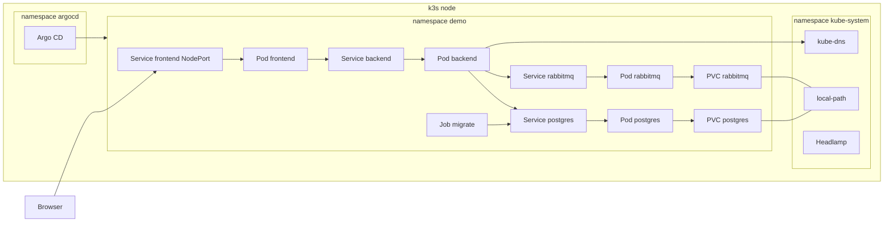
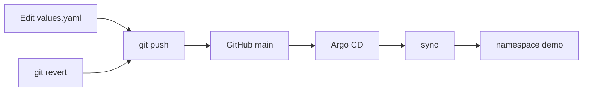
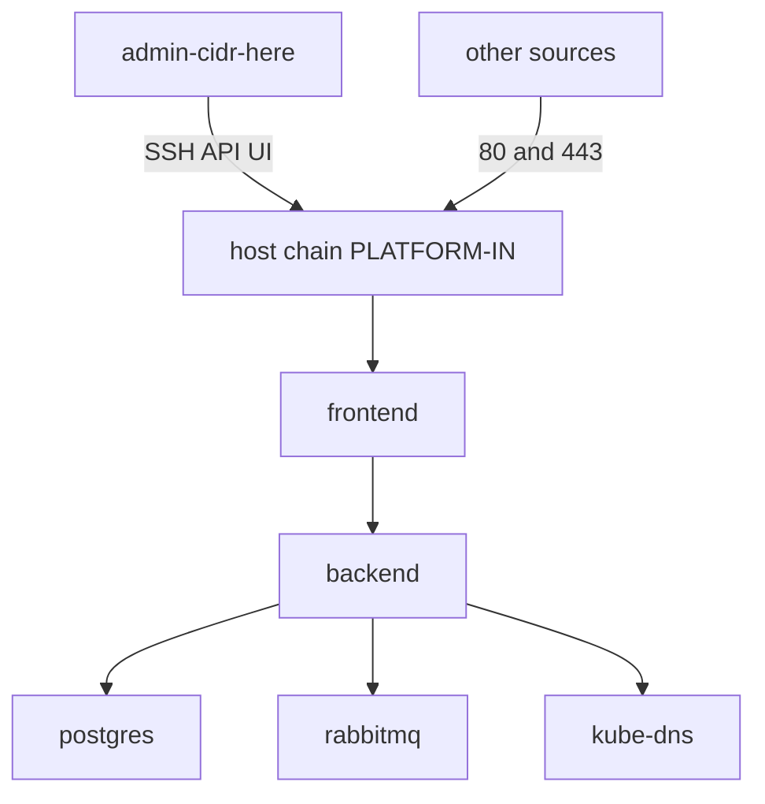

# Архитектура

Один узел k3s. В namespace `demo` чарт `charts/app-stack` поднимает frontend, backend, Postgres, RabbitMQ и Job миграции. Argo CD в namespace `argocd` синхронизирует этот чарт из git. Headlamp, DNS и StorageClass `local-path` живут в `kube-system`.

Диапазоны `10.42.0.0/16` и `10.43.0.0/16` на схемах — значения по умолчанию k3s для адресов подов и Service, не адрес стенда.

## Кластер

Frontend публикуется NodePort, потому что установщик k3s в `bootstrap/install-k3s.sh` выключает встроенный Traefik. Backend ходит в Postgres и в HTTP API брокера. Job `migrate` создаёт таблицу `items`. Оба PVC создаёт StorageClass `local-path` на диске этого узла.

Файлы: `charts/app-stack/templates/frontend.yaml`, `backend.yaml`, `postgres.yaml`, `rabbitmq.yaml`, `migrate.yaml`.

## GitOps

`argocd/application.yaml` включает automated sync, selfHeal и prune. Ручная правка пода расходится с git, и selfHeal возвращает кластер к коммиту. Откат — `git revert` и push. История sync в UI Argo CD показывает прошлые применения, но при включённом selfHeal источник правды остаётся git.

## Сеть

NetworkPolicy в чарте сначала запрещает весь трафик подов namespace, затем разрешает обмен внутри namespace, DNS в `kube-system` и вход на порт frontend. Поле `networkPolicy.frontendIngressCIDR` сужает этот вход; пустое значение оставляет `0.0.0.0/0`.

Скрипт `security/host-firewall.sh` ставит свою цепочку в начало INPUT. Порты 80 и 443 остаются открытыми. SSH, API Kubernetes и NodePort UI принимаются только из `ADMIN_CIDR`. Остальной трафик хоста цепочка не переписывает: последнее правило в ней RETURN. Таймер возвращает прежние правила, если цепочку не подтвердить. Чарт этот скрипт не запускает.

Пример тех же политик без Helm: `security/default-deny.yaml`.
